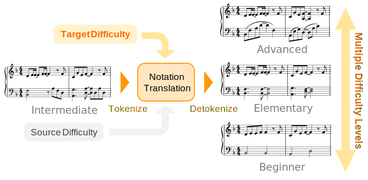
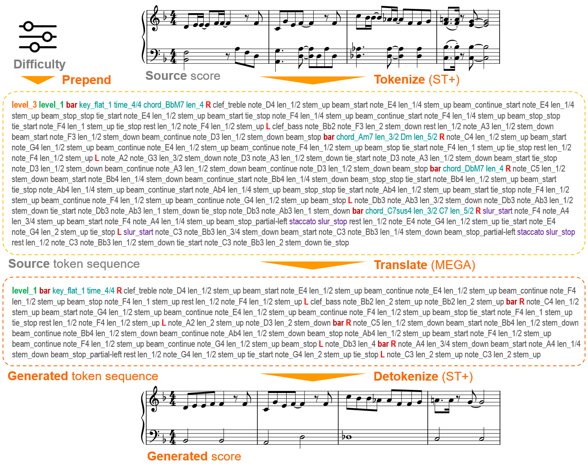

# Score Rearrangement
We propose a **notation-level rearrangement** method that changes the **difficulty level** of piano scores.
Score conversion directly on the notation domain enables us to **process musical information** in the scores **comprehensively**.

## Key Findings
- We can **directly process musical scores** on the **notation** domain using sequence models.
- We can train a **single model** that convert scores between **multiple difficulty levels**.
- **Bar-major** score token (ST+) **performs better** than staff-major score token (ST). 

## Overall Architecture
We **tokenize** score at notation level into sequence and **translate** them into another difficulty level, and then **detokenize** the result back into score. 
We use ***level*** tokens (at the beginning of source sequence) for **difficulty conditioning**.
By **changing** these tokens, users can **control the playing difficulty** of scores!

## Samples
### Source score 
- Intermediate (Lv.3)

 <audio src="audio/sample1_lv3_src.wav" controls></audio>

### Generated scores
- Beginner (Lv.1)

 <audio src="audio/sample1_lv1.wav" controls></audio>

- Elementary (Lv.2)

 <audio src="audio/sample1_lv2.wav" controls></audio>

- Advanced (Lv.4)

 <audio src="audio/sample1_lv4.wav" controls></audio>

... and more samples to come!
