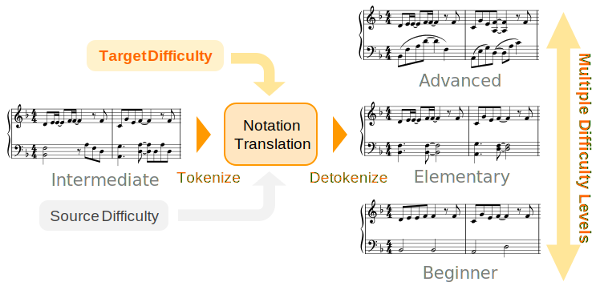
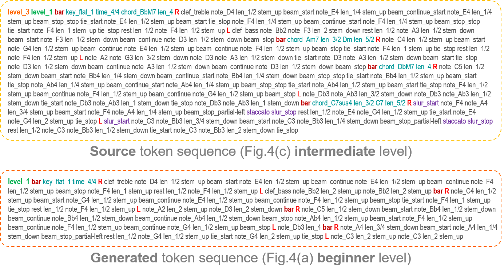

# Piano Score Rearrangement
We propose a **notation-level rearrangement** method that changes the **difficulty level** of piano scores. 
Score conversion directly on the notation domain enables us to **process musical information** in the scores **comprehensively**.

## Sample
### Source score 
- Intermediate level

 <audio src="audio/sample1_lv3_src.wav" controls></audio>

### Generated scores
- Beginner level

 <audio src="audio/sample1_lv1.wav" controls></audio>

- Elementary level

 <audio src="audio/sample1_lv2.wav" controls></audio>

- Advanced level

 <audio src="audio/sample1_lv4.wav" controls></audio>

## Token Example
Example **score token (ST+) sequences** corresponding to the scores on Fig.4 in the paper.

The ***level*** token(s) at the top are **difficulty conditioning** tokens (see Fig.2 / Section 2.1 in the paper).

Users can change these tokens on the source sequence to **control the playing difficulty** of scores. 

## Findings
- We can **directly process musical scores** on the **notation** domain.
- **Bar-major** score token (ST+) **performs better** than original staff-major score token. 
- Automatically rearranged scores are **not inferior to human-made ones**.

## Code 
coming soon!
